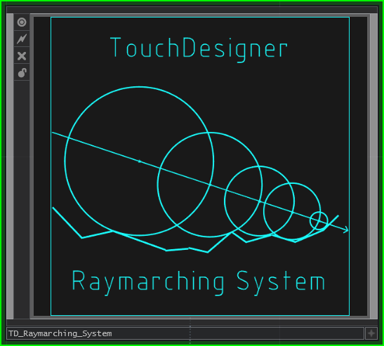
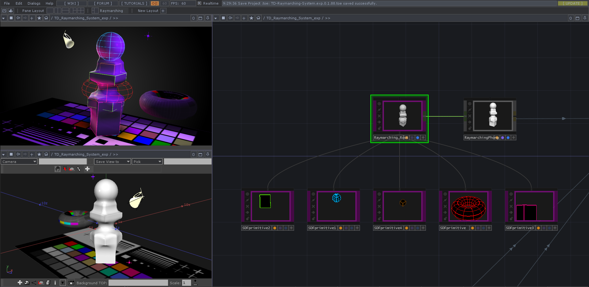
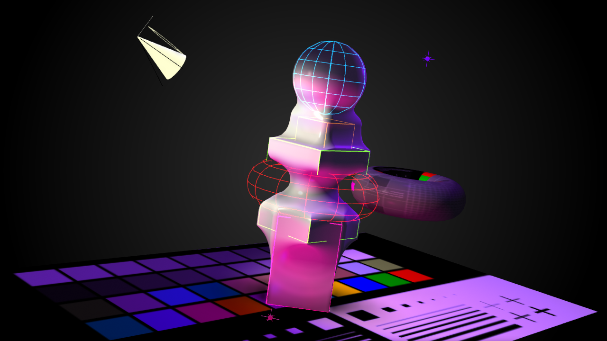

# TD-Raymarching-System

A Raymarching-System based on object COMP can be easily integrated with existing TD rendering processes.
## Work in progress.

## Todo list
### System
- [ ] SDF Create Dialog ( Integration with `TD-OPCreateDialog-Plus` )
- [ ] Group node
- [ ] Affectors node
###  Rendering
- [ ] Contvert View-Rec to Bounding Box, Reduce the fragment shader call.
- [ ] UV, texture Node
- [ ] Color blend
- [ ] Shadow
- [ ] Volumetric Rendering
### Generator
- [ ] SDF font texture generator
- [ ] mesh to SDF texture generator - 10%
### Documents
- [ ] Github Wiki

## Reference

#### Raymarching-in-TD by exsstas
 https://github.com/exsstas/Raymarching-in-TD

#### d1istance functions by Inigo Quilez
http://iquilezles.org/www/articles/distfunctions/distfunctions.htm

#### Ray Marching and Signed Distance Functions by Zerø Wind
http://jamie-wong.com/2016/07/15/ray-marching-signed-distance-functions/

## Author
#### Yea Chen (yeataro)
https://github.com/yeataro \
<yeataro@gmail.com>

## License 
[MIT license](https://github.com/yeataro/TD-Anime4K/blob/master/LICENSE)